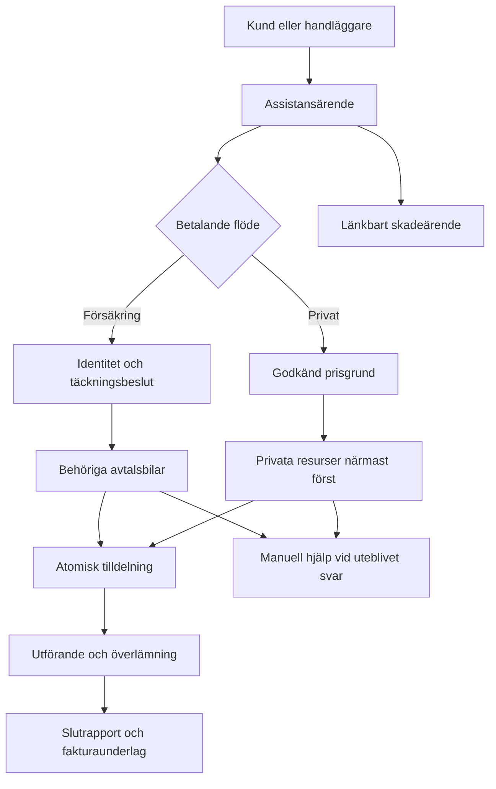

# Resqly — komplett masterplan

Version 1.0 · 2026-10-01 · Byggunderlag för hela plattformen

## 1. Mål och beslutsgrund

Resqly ska vara en sammanhängande plattform för vägassistans, bärgning och fordonsrelaterade försäkringsärenden. Försäkringsbolaget är huvudkund. Bärgningsbolag, förare, fordonsägare och senare verkstäder arbetar i samma system med olika behörigheter. Plattformen säljs under Resqlys varumärke och som white-label.

Den här planen beskriver hela målprodukten och ordningen för att färdigställa den. Arbetsfaserna är beroenden inom samma produkt; de är inte separata halvfärdiga system. Pilotens mindre driftsomfattning minskar inte helhetsplanen.

**Fastställda krav som bevaras:**

1. Separat kundwebb/PWA, kundapp, förarapp, företagsportal och plattformsadministration.
2. Försäkringsbolaget äger försäkringsärendet. Bärgarbolaget är en separat organisation som utför ett avtalsbundet uppdrag.
3. BankID används för verifiering vid fordons-/försäkringskoppling och försäkringsärende. Ordinarie kontoinloggning hanteras separat.
4. Försäkringsjobb går endast till avtalade och godkända bärgningsresurser. Alla behöriga avtalsbilar i utskicksområdet ska omfattas av försäkringsutskicket. Första giltiga accept vinner.
5. Ett obesvarat försäkringsjobb får endast fortsätta inom det godkända nätverket eller gå till manuell hjälp.
6. Privatbärgning använder en separat marknadsplatsoperatör och närmast-först-flöde med successivt större sökområde.
7. Varje bärgning har ett assistansärende. Skadeärende och assistansärende är separata begrepp och kan länkas.
8. Bärgaren tar betalt i första versionen. Resqly sparar utförande, slutrapport, prisrader och fakturaunderlag.
9. White-label omfattar partnernamn, logotyp, färger, support, juridiska texter, meddelanden och eget ärendenummerprefix. En egen subdomän är inte ett krav.
10. Kundens kontaktdata lämnas till utföraren först efter giltig tilldelning. Förare får aldrig tillgång till personnummer eller BankID-detaljer.
11. Produktionssystemet startar utan seed-/demodata. Företag, avtal, användare och resurser skapas genom verkliga administrationsflöden. Isolerade tester använder uttryckliga testfixtures.
12. Myndighets-, polis-, kommun- och Trafikverksrapportering ligger utanför Resqly.

**Nya rekommendationer i denna plan:** strikt separata tillstånd för identitet och försäkringstäckning, transaktionell outbox/inbox, resurslås över flera uppdrag, återkallad åtkomst efter omfördelning, versionsstyrda pris-/regelbeslut, mätbar driftberedskap och en verifieringsmatris. Dessa är byggförslag; de är inte påståenden om redan färdig implementation.

## 2. Verkligt utgångsläge

Repository: [heke99/resqly](https://github.com/heke99/resqly).

Kontrollerad `main` den 2026-10-01: `25840ee268e1e32e4ad5cf3a560128ac19d01f48`. Senaste commit där är daterad 2026-08-06. Inga öppna PR:er visades vid kontrollen. Det finns separata audit- och production-readiness/hardening-grenar; nästa byggagent måste jämföra dem och kontrollera lokalt arbete innan ändringar.

| Område | Vad som finns i kontrollerat underlag | Vad det betyder inför byggstart |
|---|---|---|
| Appar | `customer-web`, `customer-mobile`, `driver-mobile`, `portal-web`, `admin-web`, `api`, `workers` | Fortsätt i befintligt monorepo. Filernas existens bevisar inte färdiga användarflöden. |
| Delade paket | Auth, RBAC, database, white-label, BankID, maps, geodata, dispatch, insurance, tow, billing, notifications, audit, types/UI | Återanvänd domänpaketen och undvik parallella implementationer. |
| Databas | 27 migrationsfiler, till och med `0027_tenant_actor_consistency.sql` | Verifiera faktisk schema-/migrationshistorik mot vald miljö innan nästa migration. |
| Dispatch | Avtals-/marknadsplatsfilter, erbjudanden, radlås och unik tilldelning | Behörigheter, konkurrens mellan olika jobb och leveransgarantier behöver bevisas. |
| Webb | Kund-, partner- och administrationssidor samt portal för försäkring/bärgning | Kartlägg verkliga knappar, anropsvägar och tom-/fel-/väntelägen. |
| Integrationer | TIC, Google Routes, Resend, Expo push och workers beskrivs/har adapters | Kontraktstesta mot aktuell leverantör och rätt miljö. |
| Ekonomi | Rapport-/fakturaunderlag och privata prisfunktioner | Håll isär underlag, juridisk faktura och betalstatus. |

Två tidigare granskningar ger viktig men versionsbunden evidens:

- `RESQLY_CONSISTENCY_AUDIT.md`, 2026-08-05: domän- och aktörshärdning, men riktig databasreplay/fullständig bygg- och flödesverifiering var inte genomförd i den miljön.
- [Full audit 2026-08-06](https://github.com/heke99/resqly/blob/3243f183d3571c7fc98feb2b219a01f13cbd59a9/docs/audits/2026-08-06-resqly-full-audit.md): 20 fynd, med P0/P1-blockerare. Rapporten gäller sin dåvarande kod och miljö; varje fynd ska reproduceras eller stängas med ny evidens.

En smal källkontroll inför denna plan visar följande prioriteringar:

- `accept_tow_offer` i migration 0020 är `SECURITY DEFINER` och har villkorad identitetskontroll när `auth.uid()` inte är null. Ingen motsvarande revoke för acceptfunktionen hittades i de 27 migrationsfilerna. Faktiska live-privilegier behöver kontrolleras; källans anropsväg måste härdas och regressionstestas.
- API:s förarlistning/accept har ojämna aktiv-profilkontroller. Migration 0027 kontrollerar däremot aktivt bolag/förare/fordon och avtalsrelation när tilldelningen skrivs. Äldre inactive-driver-fynd är alltså delvis härdat och måste ombedömas per anropsväg.
- `apps/api/src/handlers/tow.ts` gör flera post-accept-skrivningar separat. En timeout/krasch kan lämna tilldelning/kunddelning utan återupptagbart kund-/partnermeddelande.
- Transaktionellt webhookmönster finns redan i `complete_bankid_session` och `finalize_tow_job` i migration 0026. Utvidga det mönstret till resterande flöden.
- Notifieringsworker saknar atomisk claim i läst köflöde; webhookpollern behöver återtagning efter krasch i delivering-läge. Företagsprovisionering/inbjudan är flerstegsskrivningar.
- Claims-grund finns i `insurance_claims` och portal. Dedikerat verkstadsflöde är ännu inte belagt som komplett. Förarens EAS-project-ID finns i läst appkonfiguration; behandla inte det äldre saknade-ID-minnet som aktuell brist.
- Ingen obligatorisk GitHub Actions-workflow hittades i den kontrollerade filinventeringen. Riktig DB-/RLS-/nativeverifiering är egna bevis utöver standardsviten.

Därför ska äldre fynd inte blint återimplementeras eller märkas som identiskt öppna. Källgranskningen är read-only och bevisar inte faktisk produktionsdrift.

**Ingen aktuell fullständig testsvit, stagingkörning eller produktionsdatabaskontroll har utförts som del av planframtagningen. Det finns ingen verifierad procentsats för hur mycket av appen som är färdig.**

## 3. Hela produkten och dess användare

| Yta | Användare | Funktioner i målprodukten |
|---|---|---|
| Publik webb | Försäkringsbolag, bärgarbolag, partners, kunder | Produktinformation, partneransökan, kontakt, white-label-erbjudande och länk till rätt kundflöde. |
| Kundwebb/PWA | Privatkund, senare företagskund/familj med mandat | Konto, fordon, försäkring, BankID-verifiering, assistans/skada, plats, bilder, prisgrund, status, ETA, kontakt, dokument och historik. |
| Kundapp iOS/Android | Samma kundroller | Samma kärnflöden, kamera, plats, push, BankID-återkomst och säker sessionshantering. Appen använder samma backend och regler som webben. |
| Förarapp iOS/Android | Aktiv inbjuden förare | Jourläge, aktuell bärgningsbil, erbjudanden, accept/avslag, navigation, kontakt efter tilldelning, status, bilder, slutrapport och återhämtning vid nätavbrott. |
| Försäkringsportal | Admin, handläggare, dispatch, ekonomi, läsroll | Ärenden, täckningsbedömning, bärgningsbeställning, avtal, godkända resurser, destination, SLA, manuell hjälp, rapporter, ekonomigranskning, statistik och integrationer. |
| Privatoperatörens portalvy | Operatörsadmin, handläggare, dispatch och ekonomi | Egna privatärenden, manuell matchning, prisgodkännande, rapportgranskning, underlag och kundhjälp inom operatörens behörighet. |
| Bärgarportal | Ägare/admin, trafikledare, ekonomi, läsroll | Förare, bärgningsfordon, jour/täckning, erbjudanden, arbetsplan, resursbyte, uppdrag, avtal, prislistor, direktmarknad, rapporter och fakturaunderlag. |
| Verkstadsportal | Mottagning, serviceansvarig, admin | Avtal, kapacitet, ankommande fordon, mottagning, överlämningsbevis och senare reparationsuppföljning. Endast tilldelade ärenden. |
| Plattformsadministration | Plattformens admin, support, drift, ekonomi | Organisationer, medlemskap, onboarding, white-label, domäner, prefix, avtal, operatör, driftköer, audit, supportåtkomst och plattformsdebitering. |
| Partner-API/utvecklarvy | Försäkrings-/fleet-/partnerintegration | Scopade klienter, skapa/läsa ärenden, beställa bärgning, status, dokument, signerade webhooks, leveransstatus, sandbox och versionsdokumentation. |

Rekommenderad första UI är svenska, med språkstruktur för engelska. Språkvalet för den separata amerikanska dispatcherprodukten ska inte överföras till Resqly.

## 4. Kärnflödet



### 4.1 Försäkringsbärgning

1. Kund loggar in eller handläggare registrerar beställningen med identifierad kund och kontakt.
2. Kunden väljer fordon och försäkring. Fordonsrelation, identitet och försäkringstäckning har separata bevis/tillstånd.
3. Händelse, problem, plats, åtkomsthinder, fordonsförmåga och kontakt samlas in. Platsen kan anges manuellt om GPS inte fungerar.
4. Kunden verifierar/signerar det försäkringsrelaterade momentet via BankID enligt bolagets policy. Resultatet binds till rätt användare och rätt objekt.
5. Försäkringsbolaget godkänner eller granskar täckning, tjänst, betalansvar och eventuell destination. Ett dokumenterat manuellt beslut fungerar där API saknas.
6. Systemet skapar assistans och ett bärgningsjobb, med låst pris-/regelversion och stabila referenser.
7. Alla behöriga avtalsbilar i aktuellt utskicksområde får serverlagrade erbjudanden. Stora mängder pagineras; ett internt maxantal får inte tyst utesluta annars behöriga bilar.
8. En aktiv, behörig förare accepterar. Jobb, resurser, andra erbjudanden, kunddelning, status, audit och meddelandeavsikt uppdateras atomiskt.
9. Kunden ser tilldelat bolag och relevant förare, status och tillgänglig ETA.
10. Föraren utför hjälp på plats eller bärgning. Destination/tillägg kan kräva godkännande.
11. Utföraren lämnar rapport, bevis, tider och kostnadsunderlag. Mottagaren kvitterar överlämning där det krävs.
12. Underlaget granskas, exporteras eller integreras med ekonomisystem. Utförande, ekonomigranskning och skadeärende avslutas oberoende av varandra.

Ingen bekräftad försäkringstäckning får härledas enbart från lyckad BankID-verifiering. BankID är identitets-/signeringsbevis, inte ett försäkringsbeslut.

**Handläggarbeställd assistans:** handläggaren arbetar med sitt eget aktiva bolagskonto. Kunden kan vara utan Resqly-konto, men beställningen måste ändå ha separat kundidentitet, kontakt, fordonsrelation och bolagsreferens. Handläggaren är beställande aktör och får inte registreras som den BankID-verifierade kunden. Kundens erforderliga verifiering kan slutföras genom en säker länk utan att kunden först behöver bli portalmedlem. Om kunden inte kan genomföra BankID ligger momentet i väntande/manuell bedömning; systemet får inte fabricera verifiering eller automatiskt kringgå kravet. Eventuell ändring av det verifieringskravet är ett separat dokumenterat verksamhetsbeslut före aktivering.

### 4.2 Privatbärgning

1. Kunden väljer privat/direkt och registrerar fordon, problem, plats och kontakt.
2. Ett ärende skapas under den uttryckligt valda interna marknadsplatsoperatören.
3. Kunden får pris eller tydlig prisgrund, tilläggsregler och vem som tar betalt. Godkännandet versionslagras.
4. Behöriga marknadsplatsresurser filtreras efter tjänst, område och tillgänglighet. Närmaste lämpliga erbjuds först; därefter nästa/sökområdet utökas.
5. Vid prisändring eller annan utförare än den godkända prisgrunden omfattar, inhämtas nytt kundgodkännande före bindande uppdrag.
6. Accept, utförande och rapport använder samma säkra kärna som försäkringsflödet.
7. Kunden betalar initialt till bärgaren. Resqly visar dokumenterad extern betalstatus endast med känd källa.

BankID följer operatörens uttryckliga privatpolicy. Privatärendet och dess dokument exponeras inte för ett försäkringsbolag.

### 4.3 Skadeärenden

Kunden kan anmäla skada med eller utan bärgningsbehov. Händelseuppgifter, fordon, bilder, vittnes-/motpartsuppgifter när relevanta, kompletteringar och handläggning ligger i skadeflödet. Assistans länkas utan att skadedata automatiskt sprids till bärgaren. Försäkringsbolaget beslutar om ersättning och reparation.

Avancerad olycksskiss, regress, automatiserad riskbedömning och AI-dokumenttolkning ligger i senare utbyggnad. AI-förslag behöver mänskligt beslut och spårbar källa; de ska inte själva neka ersättning eller godkänna betalansvar.

### 4.4 Verkstad och företagsfordon

Verkstadsrouting väljer avtalad mottagare utifrån område, fordonstyp, öppettid, kapacitet och bolagets regler. En stängd verkstad kräver nytt mål eller godkänd förvaring. Överlämning registrerar mottagare, tid, foton, nyckel-/fordonskvittens och avvikelser.

B2B/fleet tillkommer med företagskonto, fordonslista, behöriga beställare, ombud/mandat, kostnadsställen, kontaktvägar, avtalspriser och samlad rapportering. Full skade-/reparationslivscykel och hyrbil/fortsatt resa ingår i senare målomfattning, med egna leverantörskontrakt.

## 5. Behörigheter och domänmodell

### 5.1 Rollmatris

| Roll | Tillåten huvudåtkomst | Viktig gräns |
|---|---|---|
| Kund | Egna eller uttryckligt delegerade fordon och ärenden | Ingen annan kunds data; partnerbranding ger inte databehörighet. |
| Försäkringshandläggare | Egna bolagets ärenden, beslut och rapporter | Inte privatärenden eller annat försäkringsbolag. |
| Försäkringsdispatch | Beställa/tilldela inom godkänt nätverk | Får inte använda öppna marknaden som reserv. |
| Försäkringsekonomi | Godkända underlag, prisavvikelser och export | Ingen rätt till operativa ändringar genom ekonomisk läsroll. |
| Privatoperatör | Egna privatärenden, dispatch, pris-/rapportgranskning och ekonomi enligt roll | Ingen åtkomst till försäkringsärenden eller plattformsadministration genom operatörsrollen. |
| Bärgaradmin | Egna bolagets resurser, avtal och relevanta uppdrag | Inga generella rättigheter till försäkringsbolagets kundregister. |
| Trafikledare | Egna bolagets erbjudanden, arbetsplan och resurser | Resursbyte kräver nytt behörighetsbeslut för exakt förare/bil. |
| Förare med erbjudande | Begränsad förhandsinformation | Ingen kundkontakt, exakt kundplats eller känsliga bilagor före accept. |
| Aktiv tilldelad förare | Nödvändig kundkontakt, uppdragsplats och arbetsdata | Åtkomst återkallas vid omfördelning; historiska offers räcker inte. |
| Verkstad | Tilldelad leverans och nödvändiga uppgifter | Ingen generell skadeakt eller försäkringsinformation. |
| Partner-API | Explicit scopes i egen organisation | Klientens tenant-/kund-/fordons-ID måste kontrolleras mot relationerna. |
| Worker | Namngiven intern uppgift | Ingen anonym eller obegränsad klientåtkomst till privilegierade RPC:er. |
| Plattformssupport | Tidsbegränsad, ändamålsbunden åtkomst | Orsak och faktisk läs-/skrivåtkomst loggas. |

Inaktiverad organisation, medlem eller förare ska stoppas på alla relevanta anropsvägar, även filer, exporter, pushregistrering och realtime. Aktuell behörighet kontrolleras vid åtgärden; gamla JWT-roller räcker inte för känsliga operationer.

### 5.2 Datamodell: återanvänd befintliga objekt

Begreppen nedan är affärsmodell, inte instruktion att skapa nya tabeller med parallella namn. I repositoryt är exempelvis `cases` mappat till `incidents`, `driver_profiles` till `tow_drivers` och `vehicle_policies` till `vehicle_insurance_policies`. `insurance_claims` finns redan och måste kartläggas tillsammans med incidenttyperna innan skade-/assistanslänkningen vidareutvecklas.

| Objekt | Centrala relationer och ansvar |
|---|---|
| Organisation/tenant | Typ, status, medlemmar, roller, branding, domäner, regler, integrationer och prefix. |
| Kund/fordonsrelation | Kund, kundfordon, ägare/ombud, verifiering och giltighet. Kund kan ha flera fordon/försäkringar. |
| Försäkringskoppling | Fordon, bolag, policysammanhang, identitetsbevis och separat täckningsbeslut. |
| Assistans/skada | Ägande tenant, kund, fordon, händelse, skapande aktör, referens, event och länkat ärende. |
| Bärgningsjobb | Assistans, betalande flöde, plats, tjänst, kapabilitet, destination, status, regel-/prissnapshot. |
| Bärgarbolag/resurs | Utförande tenant, förare, faktiskt bärgningsfordon, jour, aktuell placering, kapabiliteter och reservation. |
| Försäkringsavtal | Försäkringsbolag ↔ bärgarbolag, datum, område, tjänster, SLA, priser och faktisk fordonsbehörighet. |
| Privatmarknad | Explicit operatör, deltagande bolag, direktorderstillstånd, geografi och prisgrund. |
| Utskick/erbjudande | Jobb, dispatchcykel, förare, bärgningsbil, företag, utgångstid, beslut och notifieringsstatus. |
| Tilldelning | Jobb och låst resurskombination, aktuell/historisk status, accepterande/ändrande aktör och kunddelning. |
| Rapport/bevis | Jobb, rapportversion, författare, arbete, tider, sträcka, bilagor och mottagningsbevis. |
| Fakturaunderlag | Rapport, prisversion, betalare, utförare, rader, godkännande, export och korrigeringar. |
| Integration/outbox/inbox | Tenant, objekt, event-ID, schema-/payloadversion, idempotens, leveransförsök och resultat. |
| Audit/operativ review | Exakt aktör, objekt, förändring, orsak, korrelation och hanteringsstatus. |

`tow_jobs.tenant_id` fortsätter betyda ägande organisation, normalt försäkringsbolaget. Utförande företag/förare/bärgningsbil har separata relationer. Alla dessa ska inte tvingas till samma tenant. Databasen måste däremot bevisa den tillåtna avtalsrelationen.

Råa identitetsuppgifter och signerade bevis inventeras var för sig. En hash är inte automatiskt anonym data och ett leverantörspayload får inte förutsättas vara fritt från personnummer. Lagra minsta nödvändiga data med rätt skydd och retention; operativa klienter ska inte läsa identitetsbevis.

## 6. Bindande byggregler

Regel-ID:n används i arbetskort och tester. De är krav för målprodukten, inte en markering att koden redan uppfyller dem.

### Ägarskap, åtkomst och verifiering

- **R01:** Servern härleder ägande tenant från verifierad fordons-/försäkringsrelation eller explicit privatoperatör. Klientens tenant-ID är aldrig ensamt auktoritativt.
- **R02:** Ärende, kund, kundfordon, försäkringsbolag och skapande aktör måste bilda en giltig kedja.
- **R03:** Utförande företag, förare och exakt bärgningsfordon måste bilda en giltig separat resurskedja.
- **R04:** Aktiv tenant och aktivt medlemskap krävs där organisationsåtkomst ges.
- **R05:** Aktiv förare krävs för erbjudande-, jobb-, position-, accept-, status- och enhetsoperationer.
- **R06:** BankID-session binds till användare, tenant, objekt, syfte och rätt innehållsversion. Callback från klient räcker inte som slutförandebevis.
- **R07:** Identitet, fordonsrelation och försäkringstäckning har separata tillstånd och källor.
- **R08:** Känsliga interna RPC:er har minsta möjliga EXECUTE-grants och uttrycklig anrops-/aktörskontroll. Anonym identitet får inte tolkas som betrodd worker.
- **R09:** Förare får kundkontakt först efter aktuell giltig tilldelning. Personnummer/BankID-bevis delas aldrig med förare.
- **R10:** Omfördelning, avstängning och avslutad åtkomst återkallar share-, fil-, realtime- och API-åtkomst. Redan utfärdade signerade URL:er har kort TTL eller hanteras via återkontrollerande proxy där omedelbar återkallelse behövs.
- **R11:** Varje viktig skrivning har exakt en skapande/ändrande aktör; attribution bevaras även när ett konto avaktiveras.
- **R12:** Domänrelationer skyddas med FK/constraints/transactions även när serverns service-role kringgår RLS.

### Dispatch och tilldelning

- **R13:** Försäkringsdispatch kräver giltigt aktivt avtal, rätt område/tjänst och explicit godkännande av faktiskt bärgningsfordons-ID. Batchgodkännande lagrar varje fordons-ID och omfattar inte framtida fordon automatiskt.
- **R14:** Försäkringsutskick omfattar alla behöriga resurser i den aktiva utskicksomgången; paginering/kapacitetsgräns får inte bli en tyst avtalsregel.
- **R15:** Saknade resurser/svar ger manuell hjälp eller nästa godkända omgång. Ingen automatisk övergång till privatmarknad.
- **R16:** Privatdispatch kräver aktivt marknadsplatsdeltagande och direktorderstillstånd, med närmast-först och konfigurerad expansion.
- **R17:** Jourläge, kapabilitet, aktuell bärgningsbil, geografisk täckning och färsk tillgänglighet kontrolleras före utskick.
- **R18:** Behörighet och resurstillgänglighet kontrolleras igen atomiskt vid accept. Ett gammalt erbjudande är inte fortsatt behörighet.
- **R19:** Exakt en aktiv tilldelning per jobb; en förare och en bärgningsbil får inte dubbelbokas över två samtidiga jobb.
- **R20:** Resurslås tas i konsekvent ordning och kräver databasconstraint/låsning över resurs, inte bara över jobb.
- **R21:** Accepterat, avvisat, avbrutet och utgånget erbjudande kan inte skrivas över av ett sent konkurrerande anrop.
- **R22:** Retry av samma giltiga accept ger samma resultat utan dubbla events, kunddelningar eller externa meddelandeavsikter.
- **R23:** Ny dispatchomgång återställer/kopplar erbjudandet till ny cykel korrekt och bevarar historik. Förare ska ha ett faktiskt pending offer när jobbet visar erbjudet.
- **R24:** Manuellt resursbyte genomgår samma avtals-/kapabilitetskontroller och återkallar gamla tilldelningens åtkomst.
- **R25:** Ett återkallat avtal stoppar nya accepter. Redan pågående jobb går till uttrycklig operativ bedömning; de avslutas inte tyst.
- **R26:** Kundkontakt måste finnas före bindande tilldelning enligt det ordinarie kundflödet; eventuellt handläggarbeställt undantag måste ha godkänd alternativ kontakt.

### Status, dokument och ekonomi

- **R27:** Statusändring använder kanonisk övergångsgraf, förväntad version/status och identifierad aktör.
- **R28:** Levererat, slutrapporterat, godkänt underlag, fakturerat och betalt är separata tillstånd.
- **R29:** Hjälp på plats kan slutföras utan transport-/lastningssteg när tjänsten tillåter det.
- **R30:** Administrativ knapp får inte simulera förarrapport eller verkligt utförande. Avvikande avslut behöver dokumenterat beslut.
- **R31:** Slutrapport kräver tjänstespecifika fält och versionsstyrda beviskrav.
- **R32:** Byte av destination, extra arbete, väntetid, förvaring och avbokningsavgift följer avtals-/prisregler och erforderligt godkännande.
- **R33:** Prislistor versioneras; redan godkänd prisgrund ändras inte när en ny prislista aktiveras.
- **R34:** Fakturaunderlag kan granskas/avvisas/korrigeras utan att utförandehistoriken skrivs om.
- **R35:** Extern fakturareferens lagras med provider/bolag. Dokumenterat fakturaunderlag är inte juridisk faktura eller bevisad betalning. Fördelning mellan flera betalare versionslagras och ska summera till godkänt totalbelopp utan överlappande debitering.
- **R36:** Externa betalningar i första versionen har källa, rapportör, tid och referens; inget automatiskt betalt från avslutat jobb.
- **R37:** Filer är privata med objektkoppling, filstorleks-/typkontroll, säker uppladdning, åtkomstkontroll och skadlig-filinnehållshantering.
- **R38:** Kund-, bärgar-, försäkrings- och verkstadsdokument delas per ändamål; hela skadeakten följer inte automatiskt med bärgningsuppdraget.

### Kommunikation, integration och drift

- **R39:** Affärstransaktion och beständig outbox skrivs i samma commit. Fel vid outbox-/audit-skrivning gör inte ett lyckat affärsbesked.
- **R40:** Workers använder lease, begränsade försök, backoff och idempotens. Krasch efter extern sändning ger kontrollerad deduplicering/avstämning.
- **R41:** Inkommande signerade webhooks sparas i beständig inbox innan behandling; samma event behandlas inte dubbelt.
- **R42:** Leverantörers event kan vara sena eller komma i annan ordning; gamla event får inte rulla tillbaka aktuellt domäntillstånd.
- **R43:** Push är signal om ett serverlagrat erbjudande. Acceptförfall och escalation styrs av servertid, inte telefonens timer.
- **R44:** Push-ticket, receipt, appens mottagningskvittens och förarens accept är olika bevisnivåer.
- **R45:** Positionsdata lagrar observationstid, mottagningstid, noggrannhet och källa. Inaktuell position visas som inaktuell.
- **R46:** Kartfel/okänd restid får inte visas som tillförlitlig live-ETA. Manuell uppskattning märks med källa.
- **R47:** En offline-accept läggs inte som lokalt lyckad tilldelning. Appen behöver aktuellt serverbesked.
- **R48:** Offline rapport/status synkas med händelse-ID, version och konfliktkontroll; bilder har separat återupptagbar kö.
- **R49:** White-label-branding är separat från dataauktorisering. Domän och deep link måste vara verifierad routinginformation.
- **R50:** Ärendenummer genereras atomiskt med unikhet per avsedd nummerdomän; prefixbyte ändrar inte historiska nummer.
- **R51:** Alla kritiska anrop/events har correlation-ID och tenant-/objektkoppling; loggar innehåller inte onödig PII.
- **R52:** Föråldrade, fastnade, uttömda och manuella köposter syns med ansvarig och nästa åtgärd.
- **R53:** Ingen mock-/testidentitet, testintegration eller demodata får behandlas som verklig i produktion.
- **R54:** Migrationer preflightar konflikter och kräver avstämning/karantän framför tyst dataradering eller automatiskt affärsgodkännande.
- **R55:** Retention är exekverad och testad, med separat policy för position, ärende, bevis, audit och ekonomidata.
- **R56:** API-scope, rate limits, nyckelrotation och webb-/appsessioner är centrala kontroller, inte enbart UI-regler.
- **R57:** Företagsprovisionering har ett återupptagbart och idempotent flöde. Delvis skapad organisation markeras ofärdig och är inte dispatchklar.
- **R58:** Produktionsdrift kräver återställningsprov, larm, runbooks och ansvarig operatör, inte endast en grön health-route.
- **R59:** Nya features är tenant-/miljöstyrda och har dokumenterat tillstånd; pilot, kodklart och produktionsaktiverat får inte blandas ihop.
- **R60:** Varje krav har verklig anropsväg och versionsbundet testbevis. En knapp, stub, mock eller statisk SQL-kontroll är inte full verifiering.

## 7. Statusmodeller

Befintliga statusvärden kartläggs först. Ingen plantext ska ensam orsaka en destruktiv namnändring eller en andra konkurrerande statusmaskin.

| Spår | Målmodell i affärsspråk |
|---|---|
| Identitet | Inte startad → pågår → verifierad, alternativt avbruten/utgången/misslyckad. |
| Försäkringstäckning | Ej bedömd → väntar bedömning → godkänd/nekad/behöver komplettering; källa och beslutstid krävs. |
| Assistans | Utkast → inskickad → pågående → utförd → avslutad, med avbokning/avvikelse. |
| Dispatch | Ej startad → söker → erbjuden → tilldelad; manuell hjälp är en hanteringskö, inte bevis på utförd bärgning. |
| Erbjudande | Pending → accepted/rejected/expired/cancelled, med dispatchcykel och serverexpiry. |
| Utförande transport | Accepterad → på väg → på plats → lastad → transport → levererad → slutrapporterad. |
| Utförande på plats | Accepterad → på väg → på plats → åtgärdad/ej åtgärdad → slutrapporterad. |
| Rapport | Utkast → inskickad → granskad/godkänd, alternativt komplettering/korrigering. |
| Fakturaunderlag | Ej klart → klart för granskning → godkänt → exporterat, med avvikelse/krediteringsunderlag. |
| Betalning, senare | Separat livscykel för debitering, återbetalning, transfer och bankutbetalning. |
| Skada/reparation | Registrerad → komplettering → bedömning → beslut → verkstad/reparation → avslutad. |

UI presenterar enkla kundord. Tekniska tillstånd/leverantörsfel exponeras i driftvyn med korrelation och åtgärd, inte som stack traces i kundflödet.

## 8. Arkitektur och integrationskontrakt

### 8.1 Behåll befintlig stack

TypeScript-monorepo med pnpm/Turborepo, Next.js-webb, Expo/React Native-mobil, Supabase Auth/Postgres/PostGIS/Storage/Realtime, partner-API och bakgrundsworkers. Exakta runtime-/paketversioner ska låsas efter F0-kontroll av lockfil, leverantörsstöd och säkerhetsfixar.

En domänåtgärd ska följa samma regel oavsett kundwebb, mobil, portal eller partner-API:

**validerad session/API-klient → aktuell aktör/behörighet → domänkommando → transaktion/constraints → event/outbox → worker → läsvy/notis.**

Kritiska mutationer centraliseras i delad service/auktoriserad RPC. Direkta tabelluppdateringar får inte bli alternativa vägar runt reglerna. RLS och grants skyddar klientvägar; databasdomänregler skyddar privilegierade servervägar.

### 8.2 API-standard

- Versionsstyrd API-yta och schema/DTO från delat types-paket.
- Idempotency key på skapa ärende, bärgningsbeställning, accept, slutrapport, export och senare betalningsoperationer.
- Samma nyckel + samma input återger tidigare resultat; samma nyckel + annan input ger konflikt.
- Stabil klientreferens och externa bolagsreferenser, inte bara intern UUID.
- Tydliga fel för obehörighet, utgånget offer, redan tilldelat, stale status, validering och beroendeavbrott. Klientens behörighet styr hur detaljer får visas.
- Pagination, kontrollerad sortering/filter, central rate limiter och audit.
- Scopes exempelvis case:read/create, tow:request/read och documents:read. Inget brett scope genom implicit backfill.
- Webhookpayload har event-ID, schema-/objektversion, correlation-ID och minimal tillåten data.

### 8.3 Leverantörskontrakt

| Integration | Implementation som ska vara färdig | Felväg och bevis |
|---|---|---|
| TIC/BankID | Backend-only nyckel, sessionbindning, rätt poll/collect, signering där krävs, QR/autostart, verifierat resultat och idempotent completion. | Avbrutet, timeout, fel kund/objekt, duplicerad/sen webhook och återkomst till rätt skärm. |
| Försäkringsbolag | Adapter per bolag för täckning, beställning, referens och status. Alternativt dokumenterat manuellt beslut och export. | Okänd täckning stannar i bedömning; integration får inte uppfinna bolagsbeslut. |
| Google Routes/Geocoding | PostGIS för behörigt kandidatfilter, vägrestid/sträcka för ETA och privatordning, aktuella fältmasker och batchgränser. | Timeout, 429 och individuella ruttfel; okänd ETA eller märkt manuell bedömning. |
| Expo push | App-/enhetsregistrering, EAS/APNs/FCM, sanitiserat innehåll, tickets/receipts, invalid token-hantering och aktuell deep link. | Appen hämtar servererbjudanden vid återkomst; utebliven push eskaleras och dubletter skapar inte extra jobb. |
| Position/realtime | Plattformsspecifika behörigheter, jour-/jobbpolicy, heartbeat, freshness och återanslutning. | Stängd app, nekad GPS, batterisparläge och nätavbrott blir synliga driftlägen. |
| Resend | Verifierad avsändare, tenant-template, queue, leverans-/felstatus och meddelandeminimering. | Fel/otillgänglig mail får inte tappa affärshändelsen; operatör kan återköra. |
| SMS/reservkanal | Valfri policy per tenant, leveranslogg, kostnads-/försöksgräns och rätt jourkontakt. | Frånvaro av SMS får inte ge falsk driftberedskap eller innehålla kunddetaljer i reservutskick. |
| Partnerwebhooks | Signatur på faktisk body, inbox/outbox, retries, version, replay och nyckelrotation. | Dubbletter, fel ordning, avbrott, fel tenant/mottagare och uttömda leveranser. |
| Ekonomisystem, senare | Provideradapter för juridisk faktura, ref/status och avstämning; Fortnox är första planerade kandidat från tidigare underlag. | Exportläge fungerar före liveadapter; inga dubbla fakturor eller falsk betalstatus. |

Aktuell TIC-dokumentation skiljer `POST .../poll`, som kontaktar BankID, från `GET .../collect`, som hämtar cachad data. Den befintliga adaptern ska kontraktstestas mot detta, inte bara mot tidigare interna mocks.

Expo dokumenterar att bakgrundspositionering stannar när användaren terminerar appen, och push-kvitto betyder överlämning till Apple/Google, inte att föraren har fått meddelandet. Därför är heartbeat, servertimer, apphämtning och manuell reservväg nödvändiga produktflöden.

Google Route Matrix har leverantörsgränser och kan returnera fel per routelement. Försäkringsbroadcastens rättighetsurval får inte påverkas av att en ETA-batch är ofullständig. Behörighet väljs först; ETA är tillgänglighets-/informationsdata och privatordning enligt beslutad regel.

## 9. Ekonomi, pris och affärsmodell

### 9.1 Första versionen

Bärgaren fakturerar/tar betalt enligt avtal. Resqly producerar underlag, inte en obligatorisk plattformsbetalning.

Prisrader kan omfatta startavgift, faktiskt avtalad sträcka, väntetid, arbete, jour, extra utrustning, avbokning/no-show och godkänd förvaring. För varje rad krävs mängd, enhet, prisversion, godkännande där relevant, utförare, betalare och skatt enligt fastställd ekonomikonfiguration.

Systemet skiljer försäkringsbolagets ansvar, kundens självrisk/egenandel och andra betalare. Tvist om en rad ska inte ändra vad föraren faktiskt gjorde. Ändringar är korrigeringsversioner med orsak.

Beloppsfördelningen behöver deklarerad valuta, precision och avrundningsregel. Summan av betalarnas andelar ska motsvara godkänt totalbelopp. Samma kostnadsandel får inte exporteras till både försäkringsbolag och kund som fullt betalansvar. Korrigeringar ska avstämmas mot tidigare exporter och ersätta/kreditera rätt andel.

### 9.2 Plattformens egna intäkter

Rekommenderad modell att utvärdera: företagsabonnemang plus ärende-/volymavgift; separat tillägg för white-label och integrationsprojekt. Exakta priser och debiterbara händelser är öppna affärsbeslut. Använd inte fakturaunderlagets bruttobelopp som Resqlys intäkt.

Lagra abonnemang/rättigheter, avtalsversion och idempotenta usage-events separat från bärgningens ersättning. Bestäm vad som räknas som debiterbart ärende, hur avbrutna/dubbla ärenden behandlas och när en korrigering krediteras.

### 9.3 Senare betalningsmodul

Kort/Swish/faktura och eventuell marketplace-utbetalning implementeras först när säljande part, betalansvar, återbetalning, tvist och avstämning är beslutade. Betalning, transfer och bankutbetalning är separata tillstånd. Signerad leverantörshändelse och avstämning bekräftar status; en lyckad webbläsarredirect gör det inte.

Stripe Connect är en möjlig senare adapter, inte pilotberoende eller redan vald ekonomisk ansvarsfördelning. Kontotyp, capability/KYC och aktuell API-modell verifieras när det beslutade flödet byggs.

## 10. White-label och onboarding

1. Plattformens admin skapar organisation med typ, namn och första administratör.
2. Produktnamn, logotyp, färger, språk, support, ärendenummerprefix, texter och avsändare konfigureras.
3. Partner kan använda gemensam domän med slug/deep link, subdomän eller verifierad egen domän.
4. Organisationens admins skapar användare, förare, bärgningsfordon och förmågor genom riktiga UI-flöden.
5. Avtal, giltighet, område, SLA, prislista och faktisk fordonsbehörighet fastställs.
6. Integrations-/notifierings-/supportkonfiguration kontrolleras.
7. Readiness visar varje saknad förutsättning och nästa åtgärd. Aktiv status innebär inte automatiskt att företaget är dispatchklart.
8. Aktivering sker när verksamhets- och tekniska krav är uppfyllda; försöks-/felstatus går att återuppta.

Separate branded mobilappar ingår i senare helhetsomfattning med egen distribution, bundle-ID, pushkonfiguration, appbutiksinnehåll och releasepolicy. Gemensam app med tenantbranding är första mobilvägen. Kundens val av branding kan inte ge medlemskap i försäkringsbolagets portal.

**Dokumentationskonflikt att lösa i F0:** äldre drift-/dispatchdokument beskriver tom lista med fordonsgodkännanden som fri kapacitet inom avtal. Konsistensunderlaget beskriver explicit godkännande av exakt bil. Målkravet är fail-closed och uttryckliga godkännanden per faktiskt fordons-ID. Om flera bilar godkänns samtidigt lagras godkännandet för varje bil; nya framtida fordon blir inte automatiskt behöriga. Befintliga avtal och data ska utredas, inte automatiskt ändras eller bakåtgodkännas.

## 11. Byggordning för hela appen

| Fas | Sammanhängande leverans | Beroenden | Klar när |
|---|---|---|---|
| **F0 — Baseline och kända fel** | Jämför grenar/lokalt arbete, kartlägg verkliga anropsvägar, verifiera schema/migrationshistorik, återbedöm 20 auditfynd och dokumentkonflikter. | Tillgång till repo; miljökontroll där åtkomst finns. | Låst commit/schema, bevarat arbete, prioriterat fyndregister och blockerarlista. |
| **F1 — Säker domänkärna** | Aktiva medlems-/förarkontroller, RPC-grants, relationer, återkallad åtkomst, statusgraf, resurslås, idempotens, atomisk audit/outbox/inbox. | F0. | Riktiga åtkomst-/transaktions-/konkurrenstester passerar för kritiska mutationer. |
| **F2 — Företag och white-label** | Full onboarding, inbjudningar, roller, förare, bilar, jour, avtal, godkännanden, pris/regler, explicit privatoperatör och readiness. | F1. | Två bolag kan sättas upp utan seed eller manuell SQL; fel går att återuppta. |
| **F3 — Försäkringsflödet** | Kundwebb + försäkringsportal + bärgarportal + förarapp: verifiering, bedömning, beställning, broadcast, accept, ETA, status, avvikelser, slutrapport samt försäkringsflödets granskade fakturaunderlag/export. | F1–F2, TIC/maps/push-kontrakt. | Hela A→Ö-flödet till godkänt underlag fungerar med verkliga telefoner och godkända datarelationer. |
| **F4 — Privat och grundekonomi** | Privatoperatör, prisgodkännande, närmast-först/expansion, rapport, granskning, underlag/export och extern betalstatus. | Gemensam kärna F1–F3. | Privatdata isoleras, prisändring hanteras och bärgaren kan debitera från korrekt underlag. |
| **F5 — Mobil och kommunikation fullt ut** | Kundapp, förarappens offline-/återhämtningsflöden, kamera/upload, push/deep links, BankID-återkomst, positionsfreshness och kanalstatus. | F3–F4; kärnförarapp byggs redan i F3. | iOS och Android täcker nät-/GPS-/push-/bakgrundslägen utan falsk tilldelning/status. |
| **F6 — Skada, verkstad och B2B** | Full handläggning/komplettering, assistanslänk, avtalad verkstadsrouting, mottagning, företagsfordon/mandat och relevanta rapporter. | F1–F5. | Respektive flöde har end-to-end-bevis och separerad dokument-/beslutsåtkomst. |
| **F7 — Ekonomiadaptrar och senare betalning** | Fakturasynk, korrigering/avstämning, plattformsabonnemang/usage, beslutade betalningar/återbetalningar och eventuell utbetalning. | Fastställt ekonomiskt ansvar + leverantörsavtal. | Riktiga sandbox-/kontraktstester, inga dubbla transaktioner och verifierbar avstämning. |
| **F8 — Partnerprodukt och utbyggnad** | Utvecklarportal, sandbox, API-versioner, branded appar, hyrbil/fortsatt resa, avancerad statistik och mänskligt granskade AI-stöd. | Stabil kärna och respektive partnerkontrakt. | Varje aktiverad funktion har full anropsväg, supportpolicy och egna releasegrindar. |
| **F9 — Full release och drift** | Samlad fryst integrationskandidat, migrationstest, full CI/build/browser/native/E2E, återställningsprov, säkerhetsgranskning och operativ överlämning. | Alla funktioner som ingår i den aktuella releasen. | Versionsbundet bevispaket, inga öppna blockerare, ansvarig drift och fastställd aktivering. |

F9-verifiering används även för varje pilotkandidat; driftberedskap väntar inte tills alla senare tillägg är byggda. Claims/verkstad/B2B/betalningar får bara aktiveras när respektive fas är verifierad.

**Rekommenderad första externa pilot:** ett försäkringsbolag, ett begränsat område, ett fåtal avtalade bärgningsbolag och deras godkända bilar. Hela flödet från kundanmälan till granskat underlag måste vara färdigt. Privatflödet kan verifieras parallellt men öppnas med egen operatör och egna villkor.

Tidsplan och kostnad låses efter F0. Utan aktuell gaplista, tillgängligt team och leverantörs-/pilotavtal skulle ett exakt veckolöfte vara missvisande. Första planeringsmilstolpen är därför en konkret leverans- och resursbedömning från verifierade arbetskort.

## 12. Acceptanskontrakt

Alla nedan är testkrav. Tabellen innehåller inga redan uppnådda testresultat. Varje kontrakt får testfil/manuellt protokoll, commit, schema, miljö, enhet och datum.

| ID | Scenario | Godkänt resultat |
|---|---|---|
| A01 | Kund A öppnar kund B:s ärende, fil, export och statusfeed. | Ingen data eller förändring; kontrollerad klientrespons. |
| A02 | Försäkringsbolag A försöker läsa bolag B eller privatoperatören. | Nekas över API, SQL-klientväg, UI, storage och realtime. |
| A03 | Bärgarbolag läser orelaterade jobb eller full kundprofil. | Endast aktuell tillåten arbetsdata delas. |
| A04 | Anonym och vanlig klientroll anropar intern accept-/status-RPC. | Nekas och inga affärsrader ändras. |
| A05 | Medlem/förare/bolag avstängs medan tidigare session är aktiv. | Alla känsliga läs-/skrivvägar stoppas omedelbart enligt sessionspolicy. |
| A06 | BankID-resultat från fel användare/ärende eller gammal version. | Kan inte verifiera det aktuella objektet. |
| A07 | Lyckad BankID men saknat täckningsbeslut. | Identiteten blir verifierad; täckningen kvarstår som okänd/väntande. |
| A08 | Avtal pausat/utgånget eller bärgningsbil inte godkänd. | Resursen får inte erbjudande och kan inte acceptera gammalt offer. |
| A09 | Behöriga avtalsbilar överstiger en intern kandidat-/ETA-batch. | Alla behöriga i utskicksområdet omfattas; ingen tyst truncering. |
| A10 | Ingen behörig avtalsresurs eller ingen svarar. | Ett hanterbart review/eskaleringsärende, ingen privatdispatch. |
| A11 | Privatjobb med flera resurser/avstånd. | Rätt närmast-först-ordning och kontrollerad expansion. |
| A12 | Två verkliga DB-sessioner, sedan stresstest med 100 samtidiga accepter på samma jobb. | Exakt en tilldelning, rätt vinnare, inga dubbla shares/events/outbox-events. |
| A13 | Två samtidiga jobb försöker boka samma förare respektive samma bärgningsbil. | Högst ett reserverar respektive resurs. |
| A14 | Timeout efter commit och upprepad accept. | Samma resultat, med leveransbar beständig kommunikation. |
| A15 | Accept/avslag/expiry/eskalering sker samtidigt. | Tillåten slutstatus och inga överlappande motsägande beslut. |
| A16 | Återdispatch efter avslag/expiry. | Aktuellt pending offer i ny cykel och bevarad historik. |
| A17 | Manuell omfördelning till otillåten bil/förare. | Nekas. Giltigt byte återkallar tidigare resursens åtkomst. |
| A18 | Transport jämfört med starthjälp på plats. | Båda kan slutrapporteras utan felaktiga obligatoriska steg. |
| A19 | Admin försöker markera färdigt utan giltig rapport. | Vanligt slutförande nekas; avvikelse kräver separat beslut. |
| A20 | Ny prislista aktiveras under pågående jobb. | Jobbets avtalade snapshot består; tillägg får eget godkännande. |
| A21 | Privatpris ändras efter att kund godkänt prisgrund. | Nytt godkännande innan bindande ändring. |
| A22 | Dubbel slutrapport/export och korrigering. | Inga dubbla ekonomirader/fakturor; korrigering är spårbar. |
| A23 | Worker kraschar före/efter extern sändning, eller två workers kör. | Köpost återhämtas, lease/idempotens håller och fel syns. |
| A24 | Dubbla/felordnade webhooks, fel signatur, gammalt replay. | Validering/deduplicering håller och aktuell status skyddas. |
| A25 | Push uteblir/dubbleras eller token blir ogiltig. | Servererbjudandet finns kvar korrekt, appen hämtar aktuellt läge, reservväg aktiveras. |
| A26 | Telefon stängs, GPS nekas, batterisparläge eller nät bryts. | Ingen falsk färsk position/ETA; föraren kan återansluta säkert. |
| A27 | Offline rapport/status med gammal serverversion. | Konflikt hanteras; ingen tyst historikomskrivning/dublett. |
| A28 | Upload av fel objekts fil, fel typ/storlek och återkallad filåtkomst. | Nekas eller hamnar i kontrollerad karantän; rätt objekt visas. |
| A29 | Prefixbyte och samtidiga ärendeskapanden för white-label. | Unika stabila nummer, historik oförändrad, rätt branding utan behörighetsläcka. |
| A30 | Avbruten organisation-/inbjudningsprovisionering. | Idempotent återupptagning, ingen falskt driftklar organisation. |
| A31 | Migrationsreplay på tom DB och produktionslik konfliktdata. | Reproducerbart schema utan tyst databortfall/automatiskt avtalsgodkännande. |
| A32 | Gallring, offboarding och historisk attribution. | Rätt data gallras, nödvändig historik/ekonomi skyddas, aktör kvarstår spårbar. |
| A33 | Verkstad stängd eller fel destination/extra arbete. | Alternativ/godkännande och prispåverkan dokumenteras. |
| A34 | Skadeärende länkas till assistans. | Sambandet visas, men bärgaren får inte hela skadeakten. |
| A35 | Företagsbeställare utan giltigt mandat/kostnadsställe. | Saknad behörighet stoppas; godkänt uppdrag har rätt ansvar och rapportering. |
| A36 | Framtida betalwebhook/återbetalning/avstämning. | Signerat resultat, separata finanstillstånd och inga dubbla belopp. |
| A37 | Fryst release återställs eller worker stoppas/återstartas. | Dokumenterat återställningsprov utan dubbla affärshändelser/sändningar. |
| A38 | Samma försäkringsscenario via webb, mobil, portal och partner-API. | Samma domänregler, behörigheter och affärsresultat. |
| A39 | Kostnaden delas mellan försäkringsbolag, kund och annan betalare, inklusive korrigering/exportretry. | Andelarna summerar till totalen med rätt valuta/avrundning; ingen överlappande dubbeldebitering. |
| A40 | Skadeanmälan → komplettering → handläggarbeslut → avslut, med assistanslänk. | Fullt flöde, rätt beslutsaktör, separata statusar och nekad obehörig åtkomst i kund-/försäkrings-/bärgaryta. |
| A41 | Verkstad tilldelas → accepterar mottagning → tar emot fordon → kvitterar överlämning. | End-to-end-kvittens och avvikelsehantering, rätt dokumentdelning och nekad annan verkstads åtkomst. |
| A42 | Handläggare beställer åt kund utan eget konto; privatoperatör hanterar sitt eget ärende. | Beställande aktör och verifierad kund hålls isär; erforderlig BankID kringgås inte. Operatören klarar egen arbetskö utan plattformens breda adminrättigheter. |

### Verifieringsordning

Under implementation körs berörd regression och relevant typ-/lintkontroll. Kritiska behörighets-, status- och transaktionsändringar testas direkt mot riktig PostgreSQL. Tunga replay-, full CI-, browser-, build- och nativekontroller samlas till en fryst integrationskandidat.

Vid fel reproduceras orsaken, rättas och berörd regression körs om. Slutkandidaten måste ändå ha aktuell bred verifiering. Äldre audit-/testresultat återanvänds endast inom samma faktiska version och omfattning.

Repositoryts befintliga kommandon att kontrollera och använda i rätt miljö:

```bash
pnpm install --frozen-lockfile
pnpm typecheck
pnpm lint
pnpm test
pnpm verify
bash packages/database/tests/validate-migrations.sh
```

Detta är körinstruktioner, inte påståenden att de har passerat nu. `pnpm verify` måste jämföras med faktisk scripts/CI-konfiguration; native-enhetstest och riktiga leverantörskontrakt är egna bevis.

## 13. Drift, säkerhet och dataskydd

- Privata buckets, tydlig access-/retentionspolicy och filer knutna till aktuellt objekt.
- RLS, grants, interna RPC-rättigheter och serverauktorisering testas som en helhet.
- MFA för privilegierad företags-/plattformsåtkomst enligt fastställd policy, kortlivad känslig åtkomst och nyckelrotation.
- Isolerad test/staging/produktion; produktionsnycklar får inte ingå i testfixtures eller frontendbundles.
- Distribuerad rate limiter för auth, BankID, dispatch och partner-API; kostnads-/volymkontroller för Maps och notifieringar.
- Transaktionsaudit ska inte sväljas. Leveranslogg får inte visa lyckat om lagringen misslyckades.
- Backuper plus faktiskt restoreprov, inte enbart att backup finns. Schema-/kodkompatibilitet och stoppad worker vid återställning dokumenteras.
- Roll- och ansvarsfördelning för personuppgifter, rättslig grund, biträdes-/leverantörsavtal, internationella överföringar, insyn/export/radering och konsekvensbedömning utreds för verkligt upplägg.
- GPS-behörighet i telefonen är inte i sig ett fullständigt juridiskt beslut om personuppgiftsbehandling. Jour-/jobbspårning begränsas och förklaras.
- Gallringstider fastställs per datatyp; inga godtyckliga standardår införs i kod utan verksamhets-/juridikbeslut.

Runbooks krävs för felroutat uppdrag, obehörig åtkomst, förlorad notifiering, BankID-/Maps-/pushavbrott, dubbeldebiteringsrisk, fastnade jobb, personuppgiftsincident och återställning.

### Operativ kontrolltavla

Visa ej tilldelade jobb, gamla erbjudanden, manuell hjälp, uteblivna klientkvittenser, gammal position, saknad ETA, fastnad rapport, prisavvikelse, misslyckad integration, äldsta köpost och saknad worker-heartbeat. Varje rad behöver ansvarig, orsak, tid, nästa åtgärd och säker retry/eskalering.

## 14. Statistik och effektmått

| Mått | Definition |
|---|---|
| Tid till tilldelning | Tilldelad tid minus godkänd beställningstid; skilj manuell/API och problemtyp. |
| Tid till ankomst | Faktisk ankomst minus godkänd beställning; ETA-fel mäts separat. |
| Uppfyllt SLA | Faktiskt utfall mot den avtalsversion som gällde på jobbet. |
| Andel manuell hjälp | Jobb som behövt manuell hantering dividerat med relevant jobbpopulation. |
| Resurs-/nätverksutfall | Erbjudanden, accepter, avslag, expiry, jour- och kapabilitetsbrister. |
| Hjälp på plats | Utförda assistanser utan transport, per tjänst och avtal. |
| Underlagsledtid | Godkänt underlag minus slutfört utförande, med kompletteringsorsaker. |
| Kostnad/avvikelse | Godkända kostnadsrader och avvikelse mot låst prisgrund; inte automatiskt besparing. |
| Leveranshälsa | Köålder, retries, receipt/appkvittens, uttömda webhook-/mail-/pushförsök. |
| Resqly-intäkt | Plattformens faktiska abonnemangs-/usage-/integrationsintäkt, skild från bärgarersättning. |

Besparingar behöver en fastställd jämförelsebas. Dashboards ska inte visa påhittad omsättning, ETA eller besparing när underlag saknas. Tvärtenant-statistik kräver uttrycklig rätt och använder aggregerad/minimerad data.

## 15. Öppna verksamhetsbeslut

Besluten stoppar bara beroende aktivering, inte oberoende grundarbete.

| ID | Beslut | Till dess |
|---|---|---|
| D01 | Första försäkringsbolag, område, tjänster, fordonstyper och driftkontakt. | Bygg konfigurerbart; ingen extern nätverksaktivering. |
| D02 | Vem får godkänna bärgningsbil, giltighet och återkallelse per avtal. | Explicit godkännande per fordons-ID; ingen behörighet från tom lista eller automatisk framtida helflotta. |
| D03 | Täckningsbeslut via partner-API eller behörig manuell bedömning. | Separat pending review och dokumenterad beslutsaktör. |
| D04 | Svarsfönster, expansion, SLA och reservväg. | Versionsstyrd konfiguration; inga universella hårdkodade löften. |
| D05 | Destination, tillägg, förvaring, no-show och avbokningsersättning. | Kräver kontraktsstyrt godkännande/prisgrund. |
| D06 | Historisk åtkomst efter omfördelning, avslut och avtalsupphörande. | Minsta operativa åtkomst; ekonomi/audit har separata ändamål. |
| D07 | Pris-/abonnemangsmodell och debiterbar händelse för Resqly. | Usage-events kan byggas utan att aktivera debitering. |
| D08 | Första ekonomisystem och juridisk fakturasäljare. | Granskning och export av fakturaunderlag. |
| D09 | Senare betalning/Swish/Connect, ansvar och återbetalningsregler. | Ingen plattformsbetalning i pilot. |
| D10 | Dataansvar, gallring, GPS-policy och underleverantörsavtal. | Dataminimerad design; riktiga persondata aktiveras först med fastställda villkor. |
| D11 | Gemensamma/branded appar, språk, distribution och partnerrelease. | Gemensam kund-/förarapp och tenantbranding; svenska först är förslag. |
| D12 | Workshop/fleet/hyrbil/fortsatt resa och leverantörers avtal. | Objekt/adapters planeras; inga automatiska externa bokningar utan avtal. |

## 16. Arbetskort och spårbar färdigställning

Varje arbetskort innehåller problem, avsedd användare, verkliga anropsvägar, regel-ID, databas-/API-/UI-delar, dependency, acceptanskontrakt, tester, migrations-/driftrisk och commit/PR.

Status hålls som **planerat → implementerat → riktat verifierat → integrationsverifierat → redo för aktivering → aktiverat**. Ett saknat leverantörsavtal är en uttrycklig extern dependency, inte en färdig integration.

| Första arbetskort | Fas | Regler | Primärt bevis |
|---|---|---|---|
| B01 Baseline, branch-/schema-/fyndjämförelse | F0 | R54, R60 | Commit/schema + reproduktion/stängning per auditfynd. |
| B02 RPC-åtkomst, aktiva medlemmar/förare | F1 | R04–R08, R12 | A01–A05. |
| B03 Aktuella shares/filer/realtime | F1 | R09–R10, R37–R38 | A03, A17, A28. |
| B04 Status, accept och resurskonkurrens | F1 | R18–R27 | A12–A17. |
| B05 Atomisk audit/outbox/inbox | F1 | R11, R39–R44, R51–R52 | A14, A23–A24. |
| B06 Organisation, resurser och white-label | F2 | R49–R50, R57 | A29–A30. |
| B07 Avtal, godkännanden och driftberedskap | F2 | R13–R18, R25 | A08–A10. |
| B08 Kundidentitet, fordonsrelation och täckning | F3 | R01–R07 | A06–A07, A38, A42. |
| B09 Försäkringsbroadcast och förarflöde | F3 | R14–R30 | A08–A19, A25–A26. |
| B10 Privatpris, privatdispatch och operatörsvy | F4 | R16, R32–R36 | A11, A20–A22, A42. |
| B11 Rapport, bevis och ekonomigranskning | F3–F4 | R28–R38 | A18–A22, A28, A39. |
| B12 Full kundapp och mobilåterhämtning | F5 | R43–R48 | A25–A28, A38. |
| B13 Claims, verkstad och mandat/fleet | F6 | R02, R32, R38 | A33–A35, A40–A41. |
| B14 Ekonomiadaptrar och beslutade betalningar | F7 | R34–R36, R39–R42 | A22, A24, A36. |
| B15 Partnerprodukt och senare tillägg | F8 | R49, R56, R59–R60 | Funktionsspecifika kontrakt och support-/releasebevis. |
| B16 Release, retention och driftsöverlämning | F9 | R51–R60 | A31–A32, A37 plus hela aktuella kandidatens bevis. |

## 17. Startinstruktion till byggagenten

> Arbeta i `heke99/resqly` och använd denna masterplan som målprodukt och spårbar backlog. Börja från faktiskt aktuellt läge: remote head, lokal HEAD, status, diff, opushade commits, grenar och pågående ägarskap. Referens för main är `25840ee268e1e32e4ad5cf3a560128ac19d01f48`; skriv inte över senare arbete. Jämför audit-/production-grenar innan implementering.
>
> Läs befintliga repo-instruktioner, README, docs och den fulla auditrapporten 2026-08-06. Kartlägg nuvarande schema och verkliga kund-/förar-/portal-/partneranropsvägar. Återanvänd befintliga domänobjekt och paket; skapa inte parallella cases/assistance/claims-tabeller bara för att planen använder affärsbegrepp.
>
> Färdigställ F0 och därefter den sammanhängande säkerhets- och domänkärnan F1. Reproducera eller stäng auditfynd med aktuell evidens, särskilt accept-RPC-grants, aktiv förar-/medlemskontroll, historisk åtkomst, resursrace och meddelanden efter commit. Gå sedan vidare genom F2–F8:s verkliga flöden enligt dependencies.
>
> Bevara försäkringens ägartenant och bärgarens separata utförande organisation. BankID är verifiering, inte automatisk försäkringstäckning. Försäkringsdispatch är avtalsstyrd broadcast och får inte gå till privatmarknad. Privatdispatch är närmast-först. Bärgaren tar betalt initialt. White-label och prefix ska fungera utan obligatorisk subdomän. Ingen produktionsseed eller myndighetsmodul.
>
> Kör riktade regressioner och relevanta typ-/lintkontroller under arbetet. Bevisa kritiska rättighets-/transaktions-/raceändringar direkt mot riktig PostgreSQL. Samla tunga replay-, browser-, native-, build- och full CI-kontroller till fryst integrationskandidat; slutkandidaten måste ha aktuell bred verifiering. Tester med sekventiella anrop bevisar inte verklig konkurrens.
>
> Commit/pusha sammanhängande reviewbara paket och håll fynd-/kravmatrisen uppdaterad. Rapportera implementerat, verifierat och externt beroende separat. Leverantörsnycklar, avtal eller business-beslut som saknas ska dokumenteras exakt; lämna fungerande konfigurations-/felväg och fortsätt oberoende arbete. Ingen funktion får markeras klar enbart genom UI, stub eller mock. Produktionsaktivering ingår bara när den är separat auktoriserad och aktuell release klarat F9.

## 18. Underlag och primärkällor

Kontrollerat 2026-10-01. Repositorylänkar är låsta till läst commit där det behövs; leverantörsdokumentation ska verifieras igen vid implementation om den ändrats.

- [Repository och README](https://github.com/heke99/resqly/blob/25840ee268e1e32e4ad5cf3a560128ac19d01f48/README.md)
- [Operativ domänmodell](https://github.com/heke99/resqly/blob/25840ee268e1e32e4ad5cf3a560128ac19d01f48/docs/operational-platform.md)
- [Avtal och dispatch](https://github.com/heke99/resqly/blob/25840ee268e1e32e4ad5cf3a560128ac19d01f48/docs/dispatch-agreements.md)
- [Befintlig E2E-plan](https://github.com/heke99/resqly/blob/25840ee268e1e32e4ad5cf3a560128ac19d01f48/docs/e2e-acceptance.md)
- [Produktionsintegrationer](https://github.com/heke99/resqly/blob/25840ee268e1e32e4ad5cf3a560128ac19d01f48/docs/production-integrations.md)
- [Audit 2026-08-06, versionsbundet tidigare fyndunderlag](https://github.com/heke99/resqly/blob/3243f183d3571c7fc98feb2b219a01f13cbd59a9/docs/audits/2026-08-06-resqly-full-audit.md)
- `RESQLY_CONSISTENCY_AUDIT.md`, tidigare leverans 2026-08-05, läst från projektunderlaget.
- Tidigare användarbeslut om BankID-verifiering, försäkringshuvudkund, separata appar, ärendelänkning, white-label, betalning via bärgaren och avgränsning från myndighetsmoduler.
- [Supabase RLS och grants](https://supabase.com/docs/guides/database/postgres/row-level-security)
- [Supabase Storage access control](https://supabase.com/docs/guides/storage/security/access-control)
- [TIC API: start, poll och collect](https://id.tic.io/docs/api)
- [TIC webhooks](https://id.tic.io/docs/webhooks)
- [Google Routes: route matrix](https://developers.google.com/maps/documentation/routes/compute_route_matrix)
- [Expo Location](https://docs.expo.dev/versions/latest/sdk/location/)
- [Expo push: leveransgarantier](https://docs.expo.dev/push-notifications/faq/)
- [Stripe webhooks, senare betalningsadapter](https://docs.stripe.com/webhooks)
- [IMY: inbyggt dataskydd och dataskydd som standard](https://www.imy.se/verksamhet/dataskydd/det-har-galler-enligt-gdpr/inbyggt-dataskydd-och-dataskydd-som-standard/)

Planens arkitektur-, säkerhets- och integrationskrav är designbeslut/inferenser utifrån produktkrav, tidigare fynd och dessa dokument. De är inte leverantörers påståenden om att Resqly redan uppfyller kraven.
